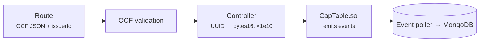

# Controllers

Controllers sit between the server-signed routes and `CapTable.sol`. Most routes validate the OCF body, the controller converts it into the contract's argument types and sends the transaction, and the event poller later writes the resulting events to MongoDB. The app's wallet path builds the same arguments in the browser with the same `@tap/units` helpers.

Transfer and the two wallet routes skip the OCF validation step.

## Conversions

- Ids: `convertUUIDToBytes16()` turns an OCF UUID into the contract's `bytes16`. It wraps `uuidToBytes16` from `@tap/units`.
- Numbers: `toScaledBigNumber()` scales quantities, prices, and authorized-share counts by 1e10. It wraps `scaleAmount` from `@tap/units`, so `"4.20"` becomes `42000000000`.
- Each controller waits for the transaction receipt before the route responds.

## Routes to contract methods

| Route | Controller function | Contract method | Role |
| --- | --- | --- | --- |
| `POST /stakeholder/create` | `convertAndReflectStakeholderOnchain` | `createStakeholder` | OPERATOR |
| `POST /stakeholder/add-wallet` | `addWalletToStakeholder` | `addWalletToStakeholder` | OPERATOR |
| `POST /stakeholder/remove-wallet` | `removeWalletFromStakeholder` | `removeWalletFromStakeholder` | OPERATOR |
| `GET /stakeholder/id/:id`, `/wallet/:address`, `/total-number` | `getStakeholderById`, `getStakeholderByWalletAddress`, `getTotalNumberOfStakeholders` | Matching read functions | None |
| `POST /stock-class/create` | `convertAndReflectStockClassOnchain` | `createStockClass` | OPERATOR |
| `GET /stock-class/id/:id`, `/total-number` | `getStockClassById`, `getTotalNumberOfStockClasses` | Matching read functions | None |
| `POST /transactions/issuance/stock` | `convertAndCreateIssuanceStockOnchain` | `issueStock` | OPERATOR |
| `POST /transactions/transfer/stock` | `convertAndCreateTransferStockOnchain` | `transferStock` | OPERATOR |
| `POST /transactions/cancel/stock` | `convertAndCreateCancellationStockOnchain` | `cancelStock` | OPERATOR |
| `POST /transactions/retract/stock` | `convertAndCreateRetractionStockOnchain` | `retractStockIssuance` | OPERATOR |
| `POST /transactions/reissue/stock` | `convertAndCreateReissuanceStockOnchain` | `reissueStock` | OPERATOR |
| `POST /transactions/repurchase/stock` | `convertAndCreateRepurchaseStockOnchain` | `repurchaseStock` | OPERATOR |
| `POST /transactions/accept/stock` | `convertAndCreateAcceptanceStockOnchain` | `acceptStock` | OPERATOR |
| `POST /transactions/adjust/issuer/authorized-shares` | `convertAndAdjustIssuerAuthorizedSharesOnChain` | `adjustIssuerAuthorizedShares` | ADMIN |
| `POST /transactions/adjust/stock-class/authorized-shares` | `convertAndAdjustStockClassAuthorizedSharesOnchain` | `adjustStockClassAuthorizedShares` | ADMIN |

OPERATOR means OPERATOR or ADMIN. `POST /issuer/create` doesn't use a controller: it calls the factory's `createCapTable` through `server/chain-operations/deployCapTable.js`. Equity compensation, convertibles, and the other MongoDB-only records have no controller.

The contract middleware loads the cap table from `issuerId`, then the controller sends the transaction. Stakeholder and stock-class create, stock issuance, cancel, retract, reissue, repurchase, acceptance, and both adjustments validate the OCF body first. `POST /transactions/transfer/stock`, `POST /stakeholder/add-wallet`, and `POST /stakeholder/remove-wallet` do not. `/stakeholder/create` and `/stock-class/create` then save the record in MongoDB. The stock transaction routes save nothing themselves; history rows come from the poller.

Related: [API Reference](/api-reference), [Solidity Reference](/protocol/solidity-reference), and [Stock Library](/protocol/stock-lib).
