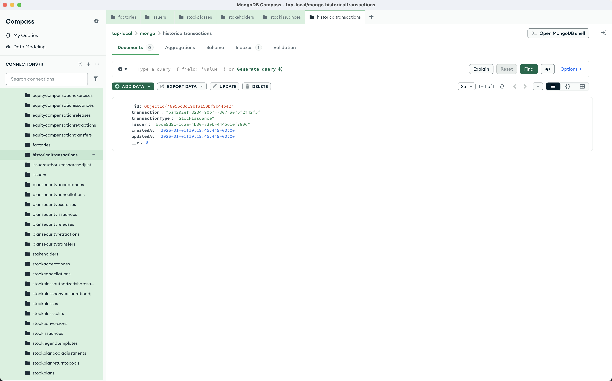

import { Steps, Callout } from 'nextra/components';

# Historical Transactions

View all transactions that have occurred on a cap table. This endpoint returns the complete history of stock issuances, transfers, cancellations, and other equity events.

<Steps>

### Send a GET request

Using Postman or curl:

```
GET http://localhost:8293/historical-transactions/issuer-id/<YOUR_ISSUER_ID>
```

<Callout type="info">
Replace `<YOUR_ISSUER_ID>` with the `_id` from your issuer creation response.
</Callout>

### Check the response

The response is an array of historical transactions, each containing:

- **`transaction`**: The full transaction object (populated from the referenced document)
- **`transactionType`**: The type of transaction (e.g., `StockIssuance`, `StockTransfer`)
- **`issuer`**: The issuer ID this transaction belongs to



</Steps>

## Transaction types

The `transactionType` field indicates what kind of transaction occurred:

| Type | Description |
|------|-------------|
| `StockIssuance` | New shares issued to a stakeholder |
| `StockTransfer` | Shares transferred between stakeholders |
| `StockCancellation` | Shares cancelled |
| `StockRetraction` | Issuance retracted |
| `StockReissuance` | Shares reissued |
| `StockRepurchase` | Company repurchased shares |
| `StockAcceptance` | Stakeholder accepted shares |
| `IssuerAuthorizedSharesAdjustment` | Issuer's authorized shares changed |
| `StockClassAuthorizedSharesAdjustment` | Stock class authorized shares changed |

## Example response

```json
[
    {
        "_id": "6956c8d19bfa150bf9b44b42",
        "transaction": {
            "_id": "ba4292ef-8234-90b7-7307-a075f2f42f5f",
            "__v": 0,
            "board_approval_date": "",
            "comments": [
                "Founder stock issuance"
            ],
            "consideration_text": "",
            "cost_basis": {
                "amount": "0",
                "currency": "USD"
            },
            "createdAt": "2026-01-01T19:19:45.441Z",
            "custom_id": "CS-A-001",
            "date": "2026-01-01",
            "is_onchain_synced": true,
            "issuance_type": "",
            "issuer": "b6ca9d9c-1daa-4b30-830b-444561ef7806",
            "object_type": "TX_STOCK_ISSUANCE",
            "quantity": "100000",
            "security_id": "56d14df5-6b04-7d93-1976-5e3f0d1703de",
            "security_law_exemptions": [],
            "share_numbers_issued": [
                {
                    "starting_share_number": "0",
                    "ending_share_number": "0"
                }
            ],
            "share_price": {
                "amount": "42000",
                "currency": "USD"
            },
            "stakeholder_id": "bf40d29d-3493-4348-98a6-c69554a4b263",
            "stock_class_id": "17dc6b51-bbfc-4f4f-8fb9-a76c167322d2",
            "stock_legend_ids": [],
            "stock_plan_id": "00000000-0000-0000-0000-000000000000",
            "stockholder_approval_date": "",
            "updatedAt": "2026-01-01T19:19:45.441Z",
            "vesting_terms_id": "00000000-0000-0000-0000-000000000000"
        },
        "transactionType": "StockIssuance",
        "issuer": "b6ca9d9c-1daa-4b30-830b-444561ef7806",
        "createdAt": "2026-01-01T19:19:45.449Z",
        "updatedAt": "2026-01-01T19:19:45.449Z",
        "__v": 0
    }
]
```

<Callout type="info">
Note that `share_price.amount` is stored as a scaled integer (42000 = $4.20 with 10^4 precision) for onchain accuracy.
</Callout>
