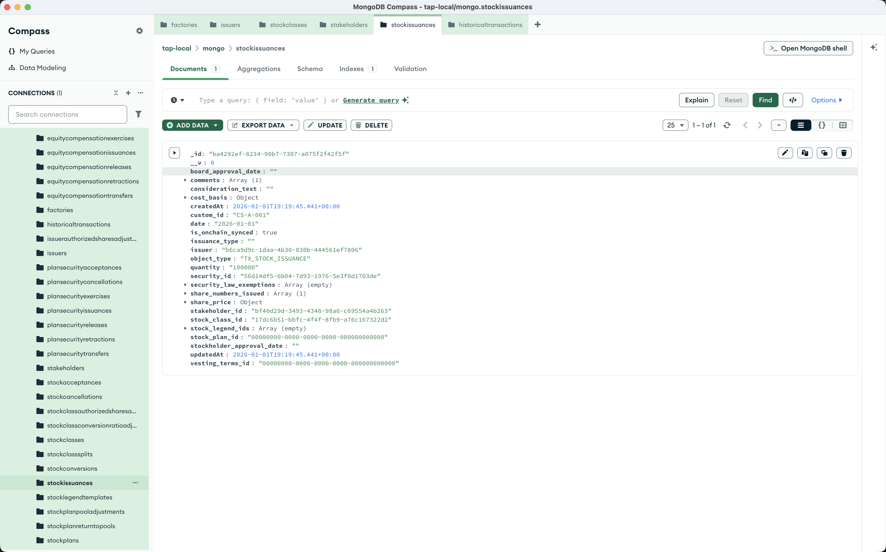

import { Steps, Callout } from 'nextra/components';

# Issue Stock

With an issuer, stock class, and stakeholder created, you can now issue stock to stakeholders. This is the first actual transaction on your cap table.

<Steps>

### Send a POST request

Using Postman or curl, send a POST request to `http://localhost:8293/transactions/issuance/stock`

```json
{
    "issuerId": "<YOUR_ISSUER_ID>",
    "data": {
        "stakeholder_id": "<YOUR_STAKEHOLDER_ID>",
        "stock_class_id": "<YOUR_STOCK_CLASS_ID>",
        "quantity": "100000",
        "share_price": {
            "amount": "4.20",
            "currency": "USD"
        },
        "stock_legend_ids": [],
        "custom_id": "CS-A-001",
        "security_law_exemptions": [],
        "comments": ["Founder stock issuance"]
    }
}
```

<Callout type="info">
Replace the IDs with the `_id` values from your previous creation responses.
</Callout>

### Check the response

The response includes your stock issuance with a generated `id` and `security_id`:

```json
{
    "stockIssuance": {
        "id": "<GENERATED_ISSUANCE_ID>",
        "security_id": "<GENERATED_SECURITY_ID>",
        "date": "2026-01-01",
        "object_type": "TX_STOCK_ISSUANCE",
        "stakeholder_id": "<YOUR_STAKEHOLDER_ID>",
        "stock_class_id": "<YOUR_STOCK_CLASS_ID>",
        "quantity": "100000",
        "share_price": {
            "amount": "4.20",
            "currency": "USD"
        },
        "stock_legend_ids": [],
        "custom_id": "CS-A-001",
        "security_law_exemptions": [],
        "comments": [
            "Founder stock issuance"
        ]
    }
}
```



<Callout type="info">
The `security_id` uniquely identifies this specific block of shares. You'll need it for future transactions like transfers or cancellations.
</Callout>

</Steps>

## Required fields

| Field | Description |
|-------|-------------|
| `stakeholder_id` | The stakeholder receiving the shares |
| `stock_class_id` | The class of stock being issued |
| `quantity` | Number of shares to issue |
| `share_price` | Price per share with currency |
| `stock_legend_ids` | Array of legend IDs (can be empty) |
| `custom_id` | A custom identifier (e.g. "CS-A-001") |
| `security_law_exemptions` | Array of exemptions (can be empty) |

## Viewing historical transactions

Once stock is issued, you can view all transactions for an issuer:

```
GET /historical-transactions/issuer-id/<YOUR_ISSUER_ID>
```

This returns all stock issuances, transfers, cancellations, and other equity events.

## What's next?

With stock issued, you can:
- Transfer stock between stakeholders via `POST /transactions/transfer/stock`
- Cancel stock via `POST /transactions/cancel/stock`
- View transaction history via `GET /historical-transactions/issuer-id/:issuerId`

See the [Transactions](/features/transactions) documentation for the full API reference.
