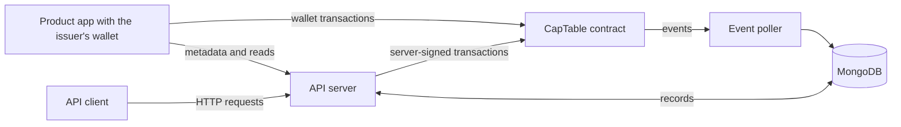

import { Cards } from 'nextra/components'

# Protocol Specification

TAP keeps each cap table in two places. The contracts hold stakeholders, stock classes, positions, and every stock transaction. MongoDB holds the same records in OCF format, plus names, contact details, and records that never go onchain. The event poller copies each onchain change into MongoDB.

| Layer | Code | Role |
| --- | --- | --- |
| Contracts | `chain/src` | The source of truth for stakeholders, stock classes, positions, and transactions. |
| Product app | `app/src` | Sends writes from the issuer's wallet and registers metadata with the API. |
| API server | `server/routes` | Serves reads, saves metadata and MongoDB-only records, and sends server-signed transactions. |
| Event poller | `server/chain-operations/transactionPoller.ts` | Copies contract events into MongoDB, including every history row. |
| OCF records | `ocf/schema`, MongoDB | The shape of every record TAP stores offchain. |

<Cards>
  <Cards.Card title="Open Cap Table Format" href="/protocol/tap-ocf" />
  <Cards.Card title="Solidity Cap Table" href="/protocol/tap-cap-table" />
  <Cards.Card title="Structs Library" href="/protocol/structs-lib" />
  <Cards.Card title="Stock Library" href="/protocol/stock-lib" />
  <Cards.Card title="Solidity Reference" href="/protocol/solidity-reference" />
</Cards>
