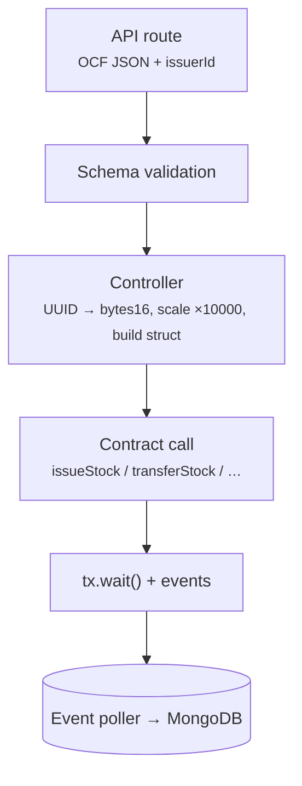
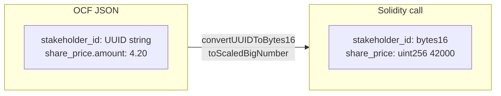
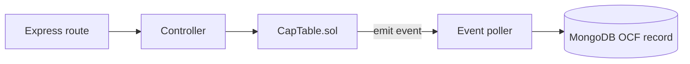

import { Callout } from 'nextra/components';

# Controllers

Controllers bridge the Express routes and `CapTable.sol`. They convert OCF data into the structs the contract expects and send the transaction; the event poller then syncs the resulting events back into MongoDB.

<Callout type="warning">
Quantities and prices are scaled by 10000 via `toScaledBigNumber()`. Divide raw onchain values by 10000 to match the numbers in API examples.
</Callout>

## Conversion

## Lifecycle

## Common patterns

- Convert IDs and numbers first: `convertUUIDToBytes16()`, `toScaledBigNumber()`.
- Wait for confirmation: `const tx = await contract.method(...); await tx.wait();`.
- Logs use ✅ and ⏳ prefixes.
- `seed.js` holds legacy bulk helpers (open TODO on dates).

## Controller Reference

| Area | Main Functions | What It Does | Contract Method |
|------|----------------|--------------|-----------------|
| **Issuer** | `convertAndAdjustIssuerAuthorizedSharesOnChain` | Scales shares and adjusts issuer authorized amount | `adjustIssuerAuthorizedShares` |
| **Stakeholder** | `convertAndReflectStakeholderOnchain`, `addWalletToStakeholder`, `removeWalletFromStakeholder`, getters | Creates stakeholder + manages wallets | `createStakeholder`, `addWalletToStakeholder`, `getStakeholderById`, etc. |
| **Stock Class** | `convertAndReflectStockClassOnchain`, `convertAndAdjustStockClassAuthorizedSharesOnchain`, getters | Creates class and adjusts authorized shares | `createStockClass`, `adjustStockClassAuthorizedShares` |
| **Transactions** | `convertAndCreate*Onchain` (one per file) | Full equity lifecycle (issue, transfer, cancel, repurchase, reissue, retract, accept) | `issueStock`, `transferStock`, `cancelStock`, `repurchaseStock`, etc. |

**Notes on Transactions**:
- `issuanceController.js` is the most complex (uses helper for defaults).
- Most pair 1:1 with an OCF schema and a Solidity function.
- Equity compensation and convertible issuances are **offchain-only** (no controller).

## How a POST route uses a controller

1. Issuer middleware attaches `req.contract`.
2. The OCF body is validated.
3. The matching controller converts and sends the transaction.
4. The OCF record is saved to MongoDB.
5. The poller backfills anything emitted by the contract.

For walkthroughs see [Create Stakeholder](/development/create-stakeholder), [Create Stock Class](/development/create-stock-class), [Issue Stock](/development/issue-stock), and [Transfer Stock](/development/transfer-stock). For the contract-side reference see [Solidity Reference](/protocol/solidity-reference) and [Stock Library](/protocol/stock-lib).
