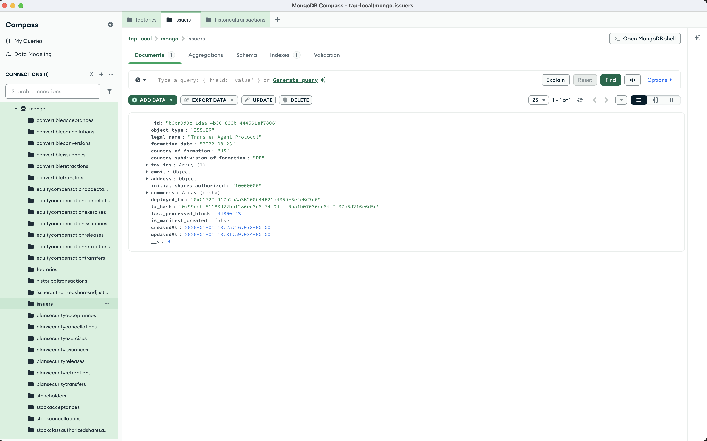

import { Steps, Callout } from 'nextra/components';

# Create an Issuer

With the server running, you can create your first issuer via the API. This deploys a new cap table contract through the factory and creates an issuer record. The issuer record is needed for every subsequent transaction.

<Steps>

### Send a POST request

Using Postman or curl, send a POST request to `http://localhost:8293/issuer/create`

```json
{
    "legal_name": "Transfer Agent Protocol",
    "formation_date": "2022-08-23",
    "country_of_formation": "US",
    "country_subdivision_of_formation": "DE",
    "initial_shares_authorized": "10000000",
    "tax_ids": [
        {
            "tax_id": "88-3977591",
            "country": "US"
        }
    ],
    "email": {
        "email_address": "alex@plume.org",
        "email_type": "BUSINESS"
    },
    "address": {
        "address_type": "LEGAL",
        "street_suite": "Empire State Building, 20 W 34th St. Suite 7700",
        "city": "New York",
        "country_subdivision": "NY",
        "country": "US",
        "postal_code": "10118"
    },
    "comments": []
}
```

All fields are validated against the [OCF schema](https://github.com/Open-Cap-Table-Coalition/Open-Cap-Format-OCF).

### Check the response

The response includes your new issuer with key fields:

- **`_id`**: The issuer ID (you'll need this for all subsequent API calls)
- **`deployed_to`**: The cap table contract address onchain
- **`tx_hash`**: The deployment transaction hash

It will look like this, with your unique `_id`

```json
{
    "issuer": {
        "_id": "b6ca9d9c-1daa-4b30-830b-444561ef7806",
        "object_type": "ISSUER",
        "legal_name": "Transfer Agent Protocol",
        "formation_date": "2022-08-23",
        "country_of_formation": "US",
        "country_subdivision_of_formation": "DE",
        "tax_ids": [
            {
                "tax_id": "88-3977591",
                "country": "US"
            }
        ],
        "email": {
            "email_address": "alex@plume.org",
            "email_type": "BUSINESS"
        },
        "address": {
            "address_type": "LEGAL",
            "street_suite": "Empire State Building, 20 W 34th St. Suite 7700",
            "city": "New York",
            "country_subdivision": "NY",
            "country": "US",
            "postal_code": "10118"
        },
        "initial_shares_authorized": "10000000",
        "comments": [],
        "deployed_to": "0xC1727e917a2aAa3B200C44B21a4359F5e4eBC7c0",
        "tx_hash": "0x99edbf81183d22bbf286ec3e8f74d0dfc40aa1b07036de8df7d37a5d216e6d5c",
        "last_processed_block": null,
        "is_manifest_created": false,
        "createdAt": "2026-01-01T18:25:26.078Z",
        "updatedAt": "2026-01-01T18:25:26.078Z",
        "__v": 0
    }
}
```



<Callout type="warning">
The `deployed_to` address is unique to your deployment—it's derived from your wallet and transaction nonce.
</Callout>

</Steps>

<Callout type="success">
Congratulations! You've deployed your first cap table smart contract.
</Callout>

## Alternative: Frontend Wallet Flow

Instead of using the API, issuers can deploy cap tables directly from the frontend at `/mint`:

1. Connect a wallet via the navigation bar
2. Fill in the issuer details (legal name, formation date, shares authorized, etc.)
3. Click **Mint Cap Table** — the connected wallet calls `createCapTable` on the factory
4. The issuer's wallet becomes **ADMIN** and the protocol server wallet receives **OPERATOR** role
5. After onchain confirmation, the frontend automatically registers the issuer in the server database via `POST /issuer/register`

In this flow, the issuer pays gas and owns their cap table. The protocol server can still manage operations (create stakeholders, issue stock, etc.) as an operator.

## What's next?

With your issuer created, continue with:
1. [Create a Stock Class](/development/create-stock-class) — define equity classes before issuing stock
2. [Create a Stakeholder](/development/create-stakeholder) — add equity holders to your cap table
