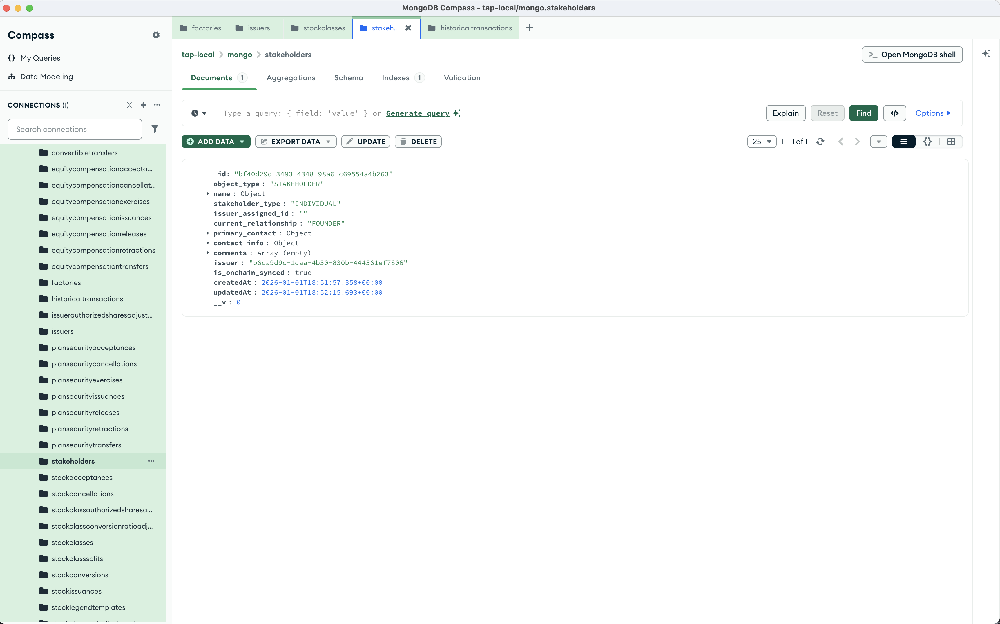

import { Steps, Callout } from 'nextra/components';

# Create a Stakeholder

Stakeholders are the equity holders on your cap table — founders, employees, investors, or any entity that holds shares.

<Steps>

### Send a POST request

Using Postman or curl, send a POST request to `http://localhost:8293/stakeholder/create`

```json
{
    "issuerId": "<YOUR_ISSUER_ID>",
    "data": {
        "name": {
            "legal_name": "Alex Palmer",
            "first_name": "Alex",
            "last_name": "Palmer"
        },
        "issuer_assigned_id": "",
        "stakeholder_type": "INDIVIDUAL",
        "current_relationship": "FOUNDER",
        "primary_contact": {
            "name": {
                "legal_name": "Alex Palmer",
                "first_name": "Alex",
                "last_name": "Palmer"
            },
            "emails": [
                {
                    "email_type": "PERSONAL",
                    "email_address": "alex@palmer.earth"
                }
            ],
            "phone_numbers": [
                {
                    "phone_type": "MOBILE",
                    "phone_number": "+1 555-555-5555"
                }
            ]
        },
        "contact_info": {
            "emails": [
                {
                    "email_type": "BUSINESS",
                    "email_address": "alex@plume.org"
                }
            ],
            "phone_numbers": [
                {
                    "phone_type": "MOBILE",
                    "phone_number": "+1 555-555-5555"
                }
            ]
        },
        "comments": []
    }
}
```

<Callout type="info">
Replace `<YOUR_ISSUER_ID>` with the `_id` from your issuer creation response.
</Callout>

### Check the response

The response includes your new stakeholder:

```json
{
    "stakeholder": {
        "_id": "<GENERATED_STAKEHOLDER_ID>",
        "object_type": "STAKEHOLDER",
        "name": {
            "legal_name": "Alex Palmer",
            "first_name": "Alex",
            "last_name": "Palmer"
        },
        "stakeholder_type": "INDIVIDUAL",
        "issuer_assigned_id": "",
        "current_relationship": "FOUNDER",
        "primary_contact": {
            "name": {
                "legal_name": "Alex Palmer",
                "first_name": "Alex",
                "last_name": "Palmer"
            },
            "emails": [
                {
                    "email_type": "PERSONAL",
                    "email_address": "alex@palmer.earth"
                }
            ],
            "phone_numbers": [
                {
                    "phone_type": "MOBILE",
                    "phone_number": "+1 555-555-5555"
                }
            ]
        },
        "contact_info": {
            "emails": [
                {
                    "email_type": "BUSINESS",
                    "email_address": "alex@plume.org"
                }
            ],
            "phone_numbers": [
                {
                    "phone_type": "MOBILE",
                    "phone_number": "+1 555-555-5555"
                }
            ]
        },
        "comments": [],
        "issuer": "<YOUR_ISSUER_ID>",
        "is_onchain_synced": false
    }
}
```



<Callout type="info">
The `is_onchain_synced` field starts as `false`. The event poller will update it to `true` once the blockchain confirms the transaction.
</Callout>

</Steps>

## Stakeholder types

The `stakeholder_type` field accepts:
- `INDIVIDUAL` — A person (founder, employee, advisor)
- `INSTITUTION` — A company or entity (VC fund, corporate investor)

## Relationship types

The `current_relationship` field accepts values like:
- `FOUNDER`
- `EMPLOYEE`
- `ADVISOR`
- `BOARD_MEMBER`
- `INVESTOR`
- `FORMER_EMPLOYEE`

## What's next?

With stakeholders and stock classes created, you can now [issue stock](/development/issue-stock) to your stakeholders.
