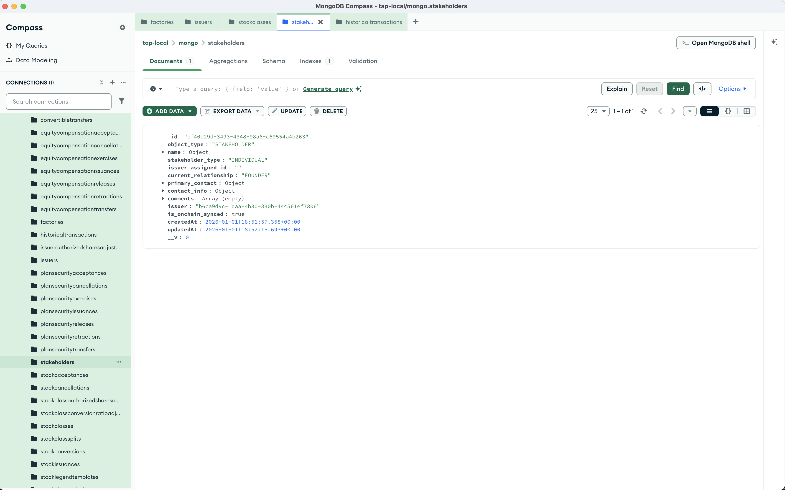

import { Steps } from 'nextra/components';

# Create a Stakeholder

Stakeholders are the equity holders on your cap table — founders, employees, investors, or any entity that holds shares.

The primary `/app` flow calls `createStakeholder` from the connected ADMIN wallet, then saves the OCF metadata with `POST /stakeholder/register-onchain` after confirmation. The server-signed `/stakeholder/create` tutorial below is the API/automation alternative.

## Minimal request

The smallest valid body identifies the issuer and the stakeholder's name, type, and relationship:

```json
{
    "issuerId": "<YOUR_ISSUER_ID>",
    "data": {
        "name": { "legal_name": "Alex Palmer" },
        "stakeholder_type": "INDIVIDUAL",
        "current_relationship": "FOUNDER"
    }
}
```

Use the full body below when you also want to capture contact details.

<Steps>

### Send a POST request

Using Postman or curl, send a POST request to `http://localhost:8293/stakeholder/create`

```json
{
    "issuerId": "<YOUR_ISSUER_ID>",
    "data": {
        "name": {
            "legal_name": "Alex Palmer",
            "first_name": "Alex",
            "last_name": "Palmer"
        },
        "issuer_assigned_id": "",
        "stakeholder_type": "INDIVIDUAL",
        "current_relationship": "FOUNDER",
        "primary_contact": {
            "name": {
                "legal_name": "Alex Palmer",
                "first_name": "Alex",
                "last_name": "Palmer"
            },
            "emails": [
                {
                    "email_type": "PERSONAL",
                    "email_address": "alex@palmer.earth"
                }
            ],
            "phone_numbers": [
                {
                    "phone_type": "MOBILE",
                    "phone_number": "+1 555-555-5555"
                }
            ]
        },
        "contact_info": {
            "emails": [
                {
                    "email_type": "BUSINESS",
                    "email_address": "alex@plume.org"
                }
            ],
            "phone_numbers": [
                {
                    "phone_type": "MOBILE",
                    "phone_number": "+1 555-555-5555"
                }
            ]
        },
        "comments": []
    }
}
```

Replace `<YOUR_ISSUER_ID>` with the `_id` from your issuer creation response.

### Check the response

The response includes your new stakeholder:

```json
{
    "stakeholder": {
        "_id": "<GENERATED_STAKEHOLDER_ID>",
        "object_type": "STAKEHOLDER",
        "name": {
            "legal_name": "Alex Palmer",
            "first_name": "Alex",
            "last_name": "Palmer"
        },
        "stakeholder_type": "INDIVIDUAL",
        "issuer_assigned_id": "",
        "current_relationship": "FOUNDER",
        "primary_contact": {
            "name": {
                "legal_name": "Alex Palmer",
                "first_name": "Alex",
                "last_name": "Palmer"
            },
            "emails": [
                {
                    "email_type": "PERSONAL",
                    "email_address": "alex@palmer.earth"
                }
            ],
            "phone_numbers": [
                {
                    "phone_type": "MOBILE",
                    "phone_number": "+1 555-555-5555"
                }
            ]
        },
        "contact_info": {
            "emails": [
                {
                    "email_type": "BUSINESS",
                    "email_address": "alex@plume.org"
                }
            ],
            "phone_numbers": [
                {
                    "phone_type": "MOBILE",
                    "phone_number": "+1 555-555-5555"
                }
            ]
        },
        "comments": [],
        "issuer": "<YOUR_ISSUER_ID>",
        "is_onchain_synced": false
    }
}
```



The `is_onchain_synced` field starts as `false`. The event poller will update it to `true` once the blockchain confirms the transaction.

</Steps>

## Required fields

| Field | Description |
| --- | --- |
| `issuerId` | Issuer `_id` from the [Create an Issuer](/development/cap-table-deploy) response. |
| `data.name.legal_name` | Stakeholder's full legal name. `first_name`/`last_name` are optional. |
| `data.stakeholder_type` | `INDIVIDUAL` or `INSTITUTION`. |
| `data.current_relationship` | Relationship enum (see below). |
| `data.issuer_assigned_id` | Optional. Pass `""` when you have no internal stakeholder ID yet — the field still appears on the record so you can update it later. Leaving it as `""` is the convention used by `mint-cap-table` imports. |

## Stakeholder types

The `stakeholder_type` field accepts:
- `INDIVIDUAL` — A person (founder, employee, advisor)
- `INSTITUTION` — A company or entity (VC fund, corporate investor)

## Relationship types

The `current_relationship` field accepts values like:
- `FOUNDER`
- `EMPLOYEE`
- `ADVISOR`
- `BOARD_MEMBER`
- `INVESTOR`
- `FORMER_EMPLOYEE`

## What's next?

With stakeholders and stock classes created, you can now [issue stock](/development/issue-stock) to your stakeholders.
