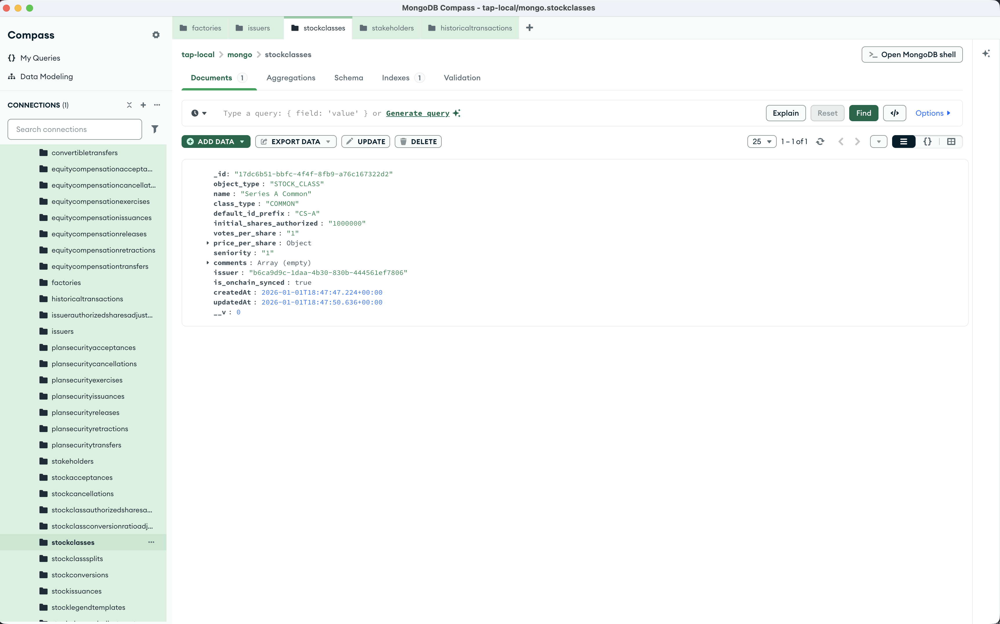

import { Steps, Callout } from 'nextra/components';

# Create a Stock Class

Stock classes define the types of equity your company can issue (e.g., Common, Preferred Series A). You must create at least one stock class before issuing stock to stakeholders.

<Steps>

### Send a POST request

Using Postman or curl, send a POST request to `http://localhost:8293/stock-class/create`

```json
{
    "issuerId": "<YOUR_ISSUER_ID>",
    "data": {
        "name": "Series A Common",
        "class_type": "COMMON",
        "default_id_prefix": "CS-A",
        "initial_shares_authorized": "1000000",
        "votes_per_share": "1",
        "price_per_share": {
            "currency": "USD",
            "amount": "4.20"
        },
        "seniority": "1",
        "comments": []
    }
}
```

<Callout type="info">
Replace `<YOUR_ISSUER_ID>` with the `_id` from your issuer creation response.
</Callout>

### Check the response

The response includes your new stock class:

```json
{
    "stockClass": {
        "_id": "<GENERATED_STOCK_CLASS_ID>",
        "object_type": "STOCK_CLASS",
        "name": "Series A Common",
        "class_type": "COMMON",
        "default_id_prefix": "CS-A",
        "initial_shares_authorized": "1000000",
        "votes_per_share": "1",
        "price_per_share": {
            "currency": "USD",
            "amount": "4.20"
        },
        "seniority": "1",
        "comments": [],
        "issuer": "<YOUR_ISSUER_ID>",
        "is_onchain_synced": false
    }
}
```


<Callout type="info">
The `is_onchain_synced` field starts as `false`. The event poller will update it to `true` once the blockchain confirms the transaction (usually within 20 seconds).
</Callout>

</Steps>

## Stock class types

The `class_type` field accepts these values per the OCF standard:
- `COMMON` — Standard common stock
- `PREFERRED` — Preferred stock (typically with liquidation preferences)

## What's next?

With a stock class created, you can now [create stakeholders](/development/create-stakeholder) who will hold equity in your company.
