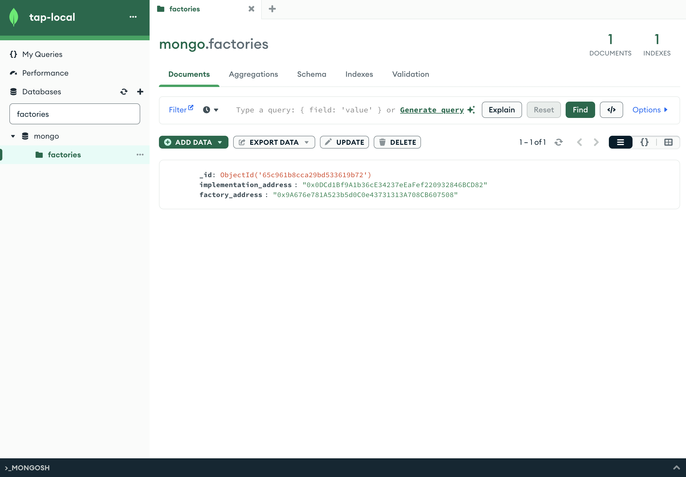

import { Steps } from 'nextra/components';
import Image from 'next/image';

# Factory smart contract

We use a factory pattern that's responsible for creating new cap tables and managing the cap table addresses. You can find the smart contract in our repo under [capTableFactory.sol](https://github.com/transfer-agent-protocol/tap-cap-table/blob/main/chain/src/CapTableFactory.sol).

## Deploy the contract
<Steps>

### Run the script to deploy the contract

With Anvil running, run our script:

```bash
pnpm run deploy-factory
```

### Check the contract address in Anvil

In your terminal, you should get the contract address after the script runs. You can also check the contract address in Anvil.

```bash
./scripts/deployFactory.sh
+ cd chain
+ forge script script/CapTableFactory.s.sol --broadcast --fork-url http://127.0.0.1:8545
[⠊] Compiling...No files changed, compilation skipped
[⠒] Compiling...
Script ran successfully.

== Logs ==
  Upgrading CapTableFactory with CapTable implementation
  Deploying CapTableFactory and CapTable implementation
  CapTable implementation deployed at: 0x0DCd1Bf9A1b36cE34237eEaFef220932846BCD82
  CapTableFactory deployed at: 0x9A676e781A523b5d0C0e43731313A708CB607508
```
### Manually add CapTableFactory to MongoDB

For this, you'll need to use Mongo Compass that you installed earlier. You can find the connection string in the `.env` file.

Under databases collection, search for `factories` and add the contract address to the collection using add data -> insert document.

```json
{
	"implementation_address": "0x0DCd1Bf9A1b36cE34237eEaFef220932846BCD82",
  	"factory_address": "0x9A676e781A523b5d0C0e43731313A708CB607508"
}
 ```

Keep in mind that your contract address will be different from the one in the example.


</Steps>

With this done, you're ready to deploy the first cap table using the factory contract. 
