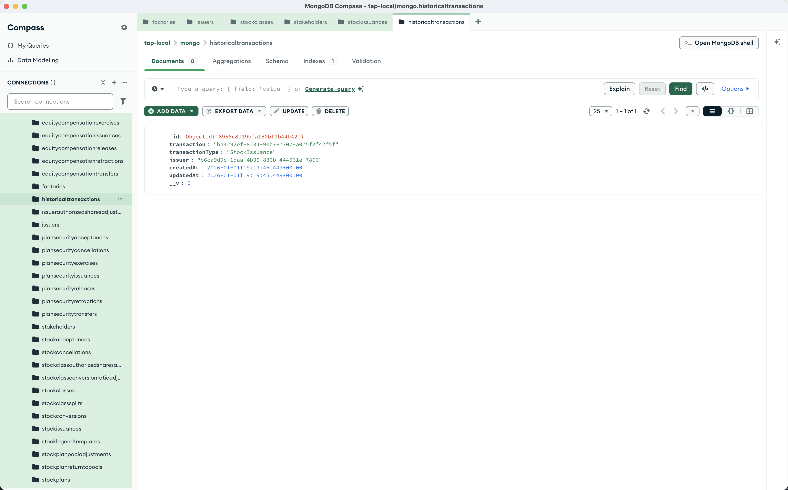

import { Steps, Callout } from 'nextra/components';

# Historical Transactions

View all transactions that have occurred on a cap table. This endpoint returns the complete history of stock issuances, transfers, cancellations, and other equity events.

<Steps>

### Send a GET request

Using Postman or curl:

```
GET http://localhost:8293/historical-transactions/issuer-id/<YOUR_ISSUER_ID>
```

<Callout type="info">
Replace `<YOUR_ISSUER_ID>` with the `_id` from your issuer creation response.
</Callout>

### Check the response

The response is an array of historical transactions, each containing:

- **`transaction`**: The full transaction object (populated from the referenced document)
- **`transactionType`**: The type of transaction (e.g., `StockIssuance`, `StockTransfer`)
- **`issuer`**: The issuer ID this transaction belongs to

<Callout type="warning">
**Price scaling:** `share_price.amount` is stored as a scaled integer for onchain precision. Divide by `10000` to get the human-readable value — for example, `42000` means `$4.20`. This applies to all monetary fields in transaction responses.
</Callout>



</Steps>

## Transaction types

The `transactionType` field indicates what kind of transaction occurred:

| Type | Description |
|------|-------------|
| `StockIssuance` | New shares issued to a stakeholder |
| `StockTransfer` | Shares transferred between stakeholders |
| `StockCancellation` | Shares cancelled |
| `StockRetraction` | Issuance retracted |
| `StockReissuance` | Shares reissued |
| `StockRepurchase` | Company repurchased shares |
| `StockAcceptance` | Stakeholder accepted shares |
| `IssuerAuthorizedSharesAdjustment` | Issuer's authorized shares changed |
| `StockClassAuthorizedSharesAdjustment` | Stock class authorized shares changed |

## Example response

```json
[
    {
        "transactionType": "StockIssuance",
        "issuer": "<YOUR_ISSUER_ID>",
        "transaction": {
            "date": "2026-01-01",
            "security_id": "56d14df5-6b04-7d93-1976-5e3f0d1703de",
            "quantity": "100000",
            "share_price": { "amount": "42000", "currency": "USD" },
            "is_onchain_synced": true
        }
    }
]
```

## What's next?

- Use `security_id` from a `StockIssuance` row to [transfer, cancel, or reissue](/features/corporate-actions/transfer-cancel-and-reissue-stock) that block of shares.
- See [View Cap Table](/features/cap-table-management/view-cap-table) to read current holdings rather than full history.
