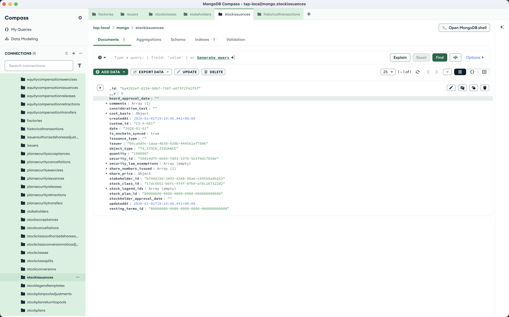

import { Steps, Callout } from 'nextra/components';

# Issue Stock

With an issuer, stock class, and stakeholder created, you can now issue stock to stakeholders. This is the first actual transaction on your cap table.

Behind the scenes, the route calls `issuanceController.js`, which converts the OCF data and invokes the `issueStock` method on the cap table contract. See the [Controllers Reference](/api-reference/controllers) for conversion details.

<Steps>

### Send a POST request

Using Postman or curl, send a POST request to `http://localhost:8293/transactions/issuance/stock`

```json
{
    "issuerId": "<YOUR_ISSUER_ID>",
    "data": {
        "stakeholder_id": "<YOUR_STAKEHOLDER_ID>",
        "stock_class_id": "<YOUR_STOCK_CLASS_ID>",
        "quantity": "100000",
        "share_price": {
            "amount": "4.20",
            "currency": "USD"
        },
        "stock_legend_ids": [],
        "custom_id": "CS-A-001",
        "security_law_exemptions": [],
        "comments": ["Founder stock issuance"]
    }
}
```

<Callout type="info">
Replace the IDs with the `_id` values from your previous creation responses.
</Callout>

### Check the response

The response includes your stock issuance with a generated `id` and `security_id`:

<Callout type="warning">
API examples use human `share_price.amount` values. Raw contract values are scaled; divide raw chain values by 10000 before comparing them to the docs.
</Callout>

```json
{
    "stockIssuance": {
        "id": "<GENERATED_ISSUANCE_ID>",
        "security_id": "<GENERATED_SECURITY_ID>",
        "date": "2026-01-01",
        "object_type": "TX_STOCK_ISSUANCE",
        "stakeholder_id": "<YOUR_STAKEHOLDER_ID>",
        "stock_class_id": "<YOUR_STOCK_CLASS_ID>",
        "quantity": "100000",
        "share_price": {
            "amount": "4.20",
            "currency": "USD"
        },
        "stock_legend_ids": [],
        "custom_id": "CS-A-001",
        "security_law_exemptions": [],
        "comments": [
            "Founder stock issuance"
        ]
    }
}
```



</Steps>

## Outputs

| Field | What it identifies |
| --- | --- |
| `id` | The issuance transaction's OCF ID. |
| `security_id` | The unique block of shares created by this issuance. **Save this** — every later transfer, cancellation, retraction, reissuance, repurchase, or acceptance reuses it. |
| `date` | Onchain timestamp at the issuance block. |

## Required fields

| Field | Description |
| --- | --- |
| `stakeholder_id` | The stakeholder receiving the shares. |
| `stock_class_id` | The class of stock being issued. |
| `quantity` | Number of shares to issue, as a string integer. |
| `share_price` | Object with human `amount` and `currency`. The contract stores `amount * 10000`. |
| `stock_legend_ids` | Legend IDs from `POST /stock-legend/create`. Pass `[]` if you don't need any. |
| `custom_id` | Issuance label (e.g. `CS-A-001`). Free-form, but unique custom IDs make support workflows easier. |
| `security_law_exemptions` | Reg D / Reg S exemptions cited by the issuance. Pass `[]` if none apply. |

## Viewing historical transactions

Once stock is issued, you can view all transactions for an issuer:

```
GET /historical-transactions/issuer-id/<YOUR_ISSUER_ID>
```

This returns all stock issuances, transfers, cancellations, and other equity events.

## What's next?

With stock issued, you can:
- Transfer stock between stakeholders via `POST /transactions/transfer/stock`
- Cancel stock via `POST /transactions/cancel/stock`
- View transaction history via `GET /historical-transactions/issuer-id/:issuerId`

See the [Cap Table API](/features) guides for the grouped API reference, especially [Transfer, Cancel, and Reissue Stock](/features/corporate-actions/transfer-cancel-and-reissue-stock).
