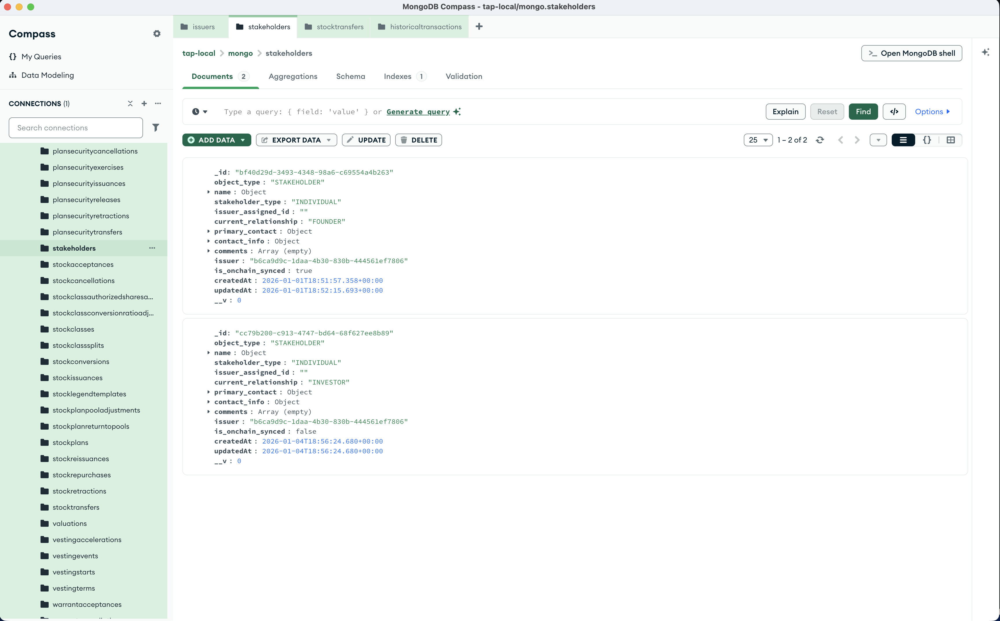
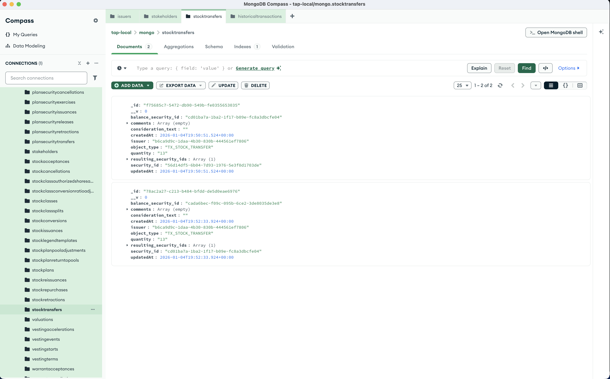
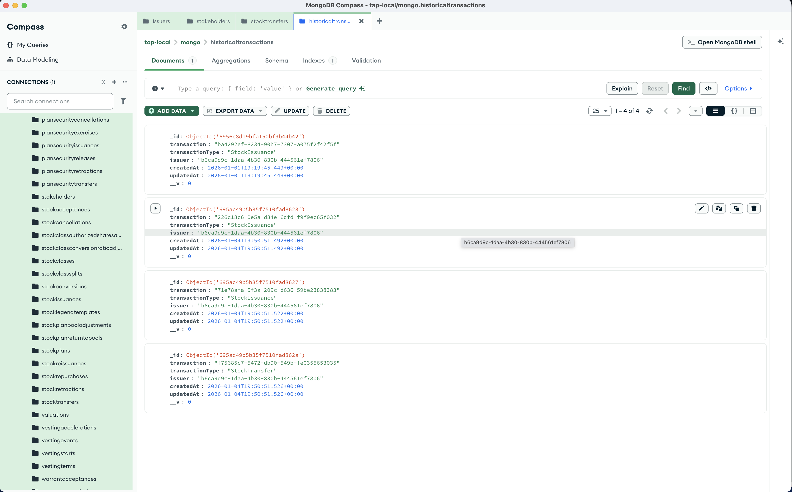

import { Steps, Callout } from 'nextra/components';

# Transfer Stock

Behind the scenes the route uses `transferController.js` to convert IDs and scaled values before calling `transferStock` on the contract. Full details are in the [Controllers Reference](/api-reference/controllers).

Transfer shares from one stakeholder to another. The recipient (transferee) must already exist on the cap table before you can transfer stock to them.

<Steps>

### Create the transferee stakeholder

Before transferring, ensure the recipient exists. Send a POST request to `http://localhost:8293/stakeholder/create`

```json
{
    "issuerId": "<YOUR_ISSUER_ID>",
    "data": {
        "name": {
            "legal_name": "Zach McKinnon",
            "first_name": "Zach",
            "last_name": "McKinnon"
        },
        "issuer_assigned_id": "",
        "stakeholder_type": "INDIVIDUAL",
        "current_relationship": "INVESTOR",
        "primary_contact": {
            "name": {
                "legal_name": "Zach McKinnon",
                "first_name": "Zach",
                "last_name": "McKinnon"
            },
            "emails": [
                {
                    "email_type": "BUSINESS",
                    "email_address": "zachary@plume.org"
                }
            ],
            "phone_numbers": [
                {
                    "phone_type": "MOBILE",
                    "phone_number": "+1 555-555-555"
                }
            ]
        },
        "contact_info": {
            "emails": [
                {
                    "email_type": "BUSINESS",
                    "email_address": "zachary@plume.org"
                }
            ],
            "phone_numbers": [
                {
                    "phone_type": "MOBILE",
                    "phone_number": "+1 555-555-555"
                }
            ]
        },
        "comments": []
    }
}
```



<Callout type="info">
See [Create a Stakeholder](/development/create-stakeholder) for more details on stakeholder fields.
</Callout>

### Transfer the stock

Send a POST request to `http://localhost:8293/transactions/transfer/stock`

```json
{
    "issuerId": "<YOUR_ISSUER_ID>",
    "data": {
        "transferorId": "<FROM_STAKEHOLDER_ID>",
        "transfereeId": "<TO_STAKEHOLDER_ID>",
        "stockClassId": "<STOCK_CLASS_ID>",
        "quantity": "13",
        "sharePrice": "4.20",
        "isBuyerVerified": true
    }
}
```

The response returns `"success"` when the transfer is recorded onchain.

<Callout type="warning">
`sharePrice` is the human price per share. Raw contract values are scaled; divide raw chain values by 10000 before comparing them to the docs.
</Callout>



### Verify the transfer

Check historical transactions to confirm:

```
GET /historical-transactions/issuer-id/<YOUR_ISSUER_ID>
```



</Steps>

## Required fields

| Field | Description |
| --- | --- |
| `transferorId` | Stakeholder transferring the shares (seller). |
| `transfereeId` | Stakeholder receiving the shares (buyer). |
| `stockClassId` | The class of stock being transferred. |
| `quantity` | Number of shares to transfer, as a string integer. |
| `sharePrice` | Human price per share. The contract stores `sharePrice * 10000`. |
| `isBuyerVerified` | `true` once the buyer has cleared whatever KYC/eligibility check your application requires. The contract reverts with `UnverifiedBuyer` if this is `false`. |

## Partial transfers

If `quantity` is less than the current position on `security_id`, the contract automatically issues a *balance security* back to the transferor for the leftover shares. The new `security_id` shows up in [history](/development/historical-transactions); use it for any later action on the leftover position.

## What's next?

After transferring stock, you can:
- View all transactions via `GET /historical-transactions/issuer-id/:issuerId`
- Cancel stock via `POST /transactions/cancel/stock`
- Issue more stock via `POST /transactions/issuance/stock`

See the [Cap Table API](/features) guides for the grouped API reference, especially [Transfer, Cancel, and Reissue Stock](/features/corporate-actions/transfer-cancel-and-reissue-stock).
